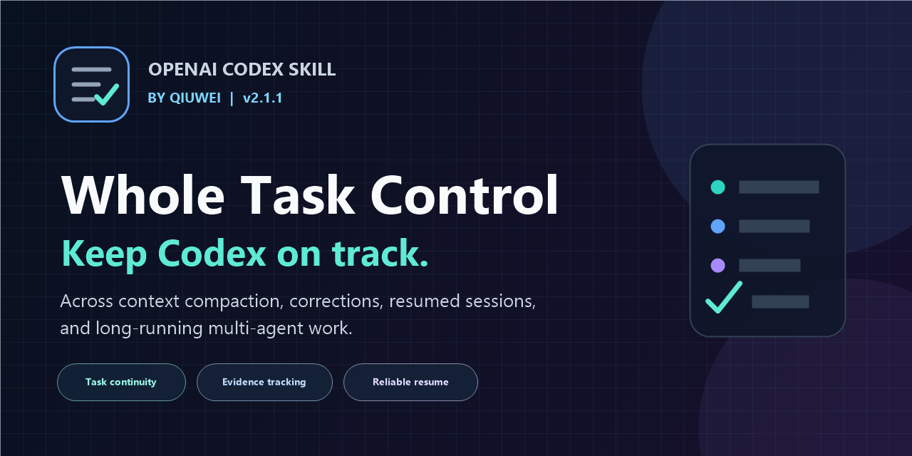

# Whole Task Control for Codex

[简体中文](README.zh-CN.md) | English

[](https://github.com/qiuweidom-oss/whole-task-control-codex/releases)
[](LICENSE)




**Keep long-running Codex tasks aligned—even after context compaction, corrections, resumed sessions, and multi-agent work.**

Whole Task Control is an open-source skill for OpenAI Codex. It prevents task drift by reconstructing the whole task, preserving confirmed decisions, reconciling real progress, and applying new instructions only to the parts they actually change.

Created by **qiuwei**.

> Community project. Not affiliated with or endorsed by OpenAI.

It was created after a recurring failure pattern: when Codex conversations became long and were compacted repeatedly, the agent could lose the thread of the real task, follow only the newest message, redo completed work, or produce patches that conflicted with earlier decisions.

This skill does not make the context window larger. It gives the root Codex agent a disciplined way to reconstruct and advance the whole task from the context, decisions, artifacts, and progress that still exist.

## At a glance

- Rebuilds the whole-task picture after context compaction or session resume.
- Preserves confirmed decisions while applying local corrections precisely.
- Separates discussion, examples, and evidence from authorization to modify files.
- Reconciles completed work before planning the next step.
- Keeps one root agent accountable when multiple subagents contribute.
- Installs safely on Windows, macOS, and Linux with preview, backup, restore, and uninstall support.

## Problems it solves

- A local correction accidentally replaces the entire approved plan.
- Work drifts after context compaction or a resumed session.
- Completed work is repeated because real progress was not reconciled.
- A single example, ID, color, coordinate, or wording becomes a hard-coded general rule.
- Discussion is mistaken for authorization to modify files.
- Multiple subagents produce disconnected results with no single owner.
- The user receives a chain of partial patches instead of one final canonical version.

## What it does

When a task depends on accumulated context, the root agent follows a six-step control loop:

1. Restore the relevant outcome, decisions, constraints, artifacts, and progress.
2. Classify the newest message as evidence, correction, replacement, authorization, pause, or another task update.
3. Merge only the affected parts while preserving unrelated confirmed decisions and valid progress.
4. Reconcile the next response or action with the whole task.
5. Respond or act from the integrated conclusion.
6. Persist material decisions in the existing goal or canonical artifact when appropriate.

It also separates examples from reusable rules, discussion from authorization, and root-agent ownership from bounded subagent work.

## When it activates

The skill is designed for:

- multi-turn decisions and corrections;
- long-running plans or implementation work;
- context compaction and session recovery;
- multiple interdependent steps;
- coordinated subagents;
- final plans, prompts, directives, or other canonical outputs.

It should not activate for self-contained, low-risk, single-step requests such as a simple translation or factual answer.

## Install on Windows

Open PowerShell in the extracted repository directory.

Preview without changing files:

```powershell
.\install.ps1 -DryRun
```

Install:

```powershell
.\install.ps1
```

If PowerShell blocks local scripts, allow them only for the current window:

```powershell
Set-ExecutionPolicy -Scope Process Bypass
```

## Install on macOS or Linux

Preview without changing files:

```sh
sh install.sh --dry-run
```

Install:

```sh
sh install.sh
```

If an unmanaged skill with the same name already exists, inspect it first and use `-Replace` on Windows or `--replace` on macOS/Linux only when you intend to replace it. The installer creates a backup before replacement.

After installation, start a new Codex task or restart Codex.

## Use it

The installed global rule loads the full skill only when the task depends on prior decisions, progress, corrections, recovery, or coordinated steps.

To invoke it explicitly:

```text
Use $whole-task-control to continue this task from the full conversation, confirmed decisions, and real progress.
```

## Uninstall and restore

Windows:

```powershell
.\uninstall.ps1
.\restore.ps1
```

macOS/Linux:

```sh
sh uninstall.sh
sh restore.sh
```

Install, uninstall, and restore operations create timestamped backups. Dry-run options are available for all three operations. Restore can replace changes made after the selected snapshot, so it creates a new safety backup before restoring.

## Safety boundaries

- The installer, uninstaller, and restore tools only operate in the Codex configuration directory; they do not read or modify project code or Claude Code.
- While the skill is active, Codex may read or modify project files only when the user's task and existing permissions authorize that work. Installing this skill grants no additional authority.
- Existing unrelated global rules are preserved.
- Malformed or reversed managed markers stop installation before skill files are copied.
- Unmanaged same-name skills are protected unless replacement is explicitly authorized.
- Windows paths are checked before mutation to prevent unsafe partial writes.

## Test

Windows PowerShell:

```powershell
powershell.exe -NoProfile -ExecutionPolicy Bypass -File .\tests\test_install.ps1
```

macOS, Linux, or Git Bash:

```sh
sh tests/test_install.sh
```

## What it is not

Whole Task Control is not a larger context window, vector database, task scheduler, or permanent memory system. It is a control method for using the available conversation, goals, files, and progress without losing the whole task.

## License

MIT. See [LICENSE](LICENSE).

## Contributing

Run both test suites before submitting a change. Keep shell scripts on LF line endings and PowerShell files encoded as UTF-8 with BOM; the tests enforce these release requirements.
